# Machine Learning Examples in Python

Collection of machine learning examples implemented in Python.

# Classifiers

## Decision Tree

Decision tree is a classification method that splits data into two subsets based on the classification criteria, and then uses those two subsets to split further into further subsets based on the other classification criteria.

### Decision Tree for Iris Dataset

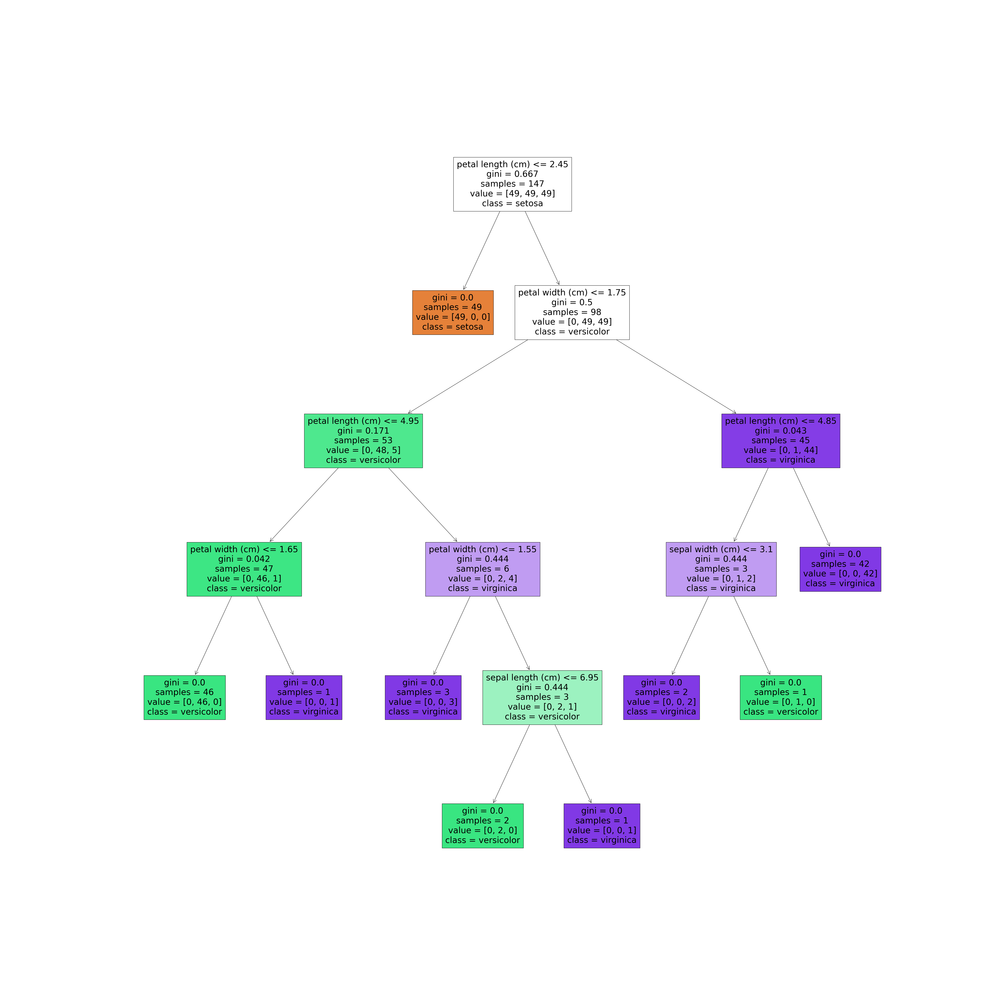

## Support-Vector Machines (SVM) 

Support vector machine is a supervised learning method that is used to train a neural network model that is able to find the relationship between two given features. It acts as a classification method that uses the features extracted from face images to classify different people into different categories. 

### Face Recognition

Example of SVM usage for recognizing faces of famous people.

#### Fragment of the Test Dataset

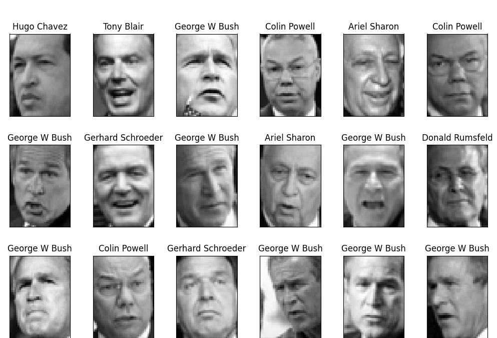

#### Description of the Dataset

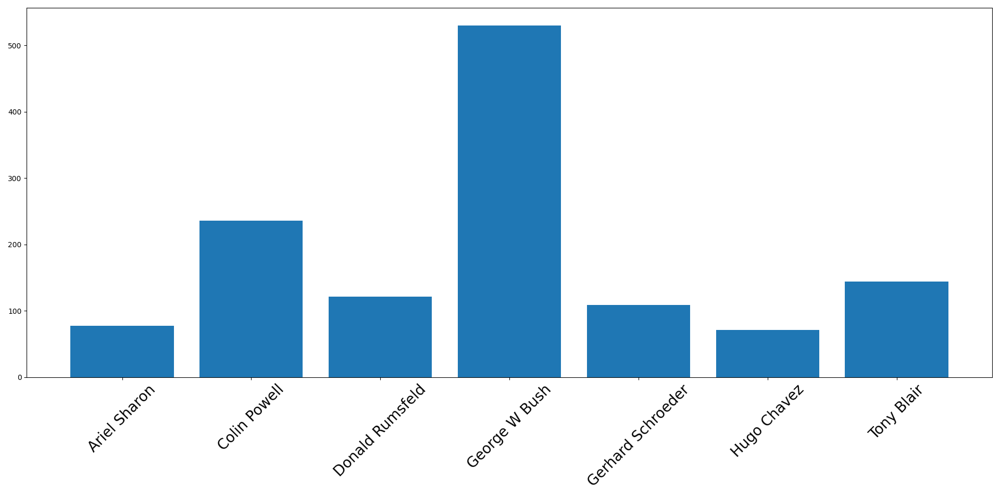

#### Fragment of the Prepared Data

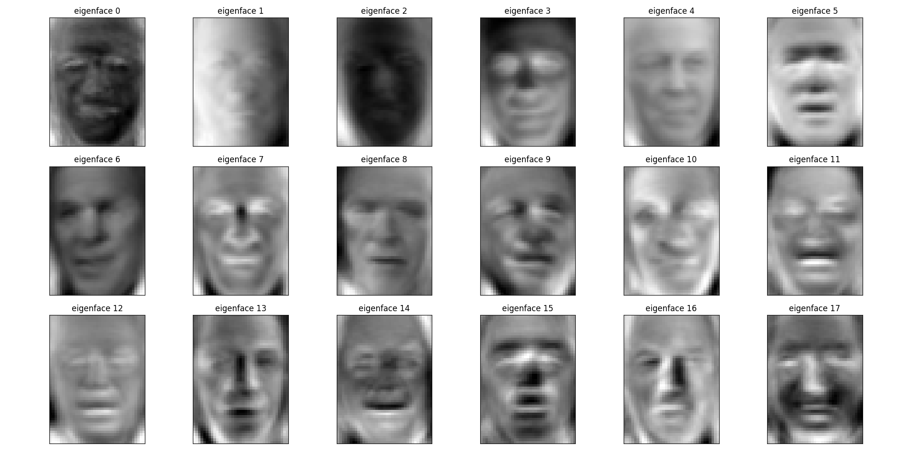

#### Prediction Result

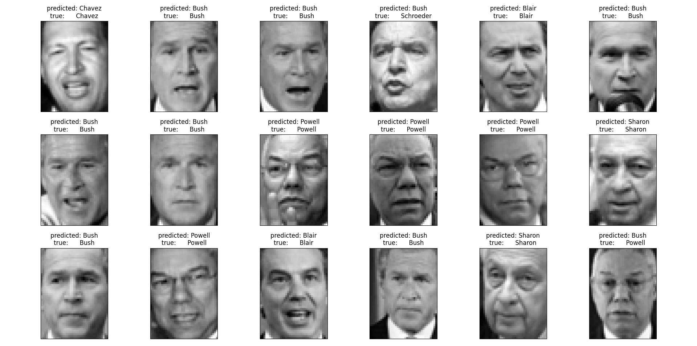

# Clustering

## Ward hierarchical clustering

Ward hierarchical clustering is a data clustering method that uses a linkage matrix to estimate the similarity between the features of two groups of objects. The clustering scheme is the Ward method, which groups the objects in a hierarchical fashion based on the most similar pairs of objects, and gives them the same cluster label.

### Coins

#### Source image

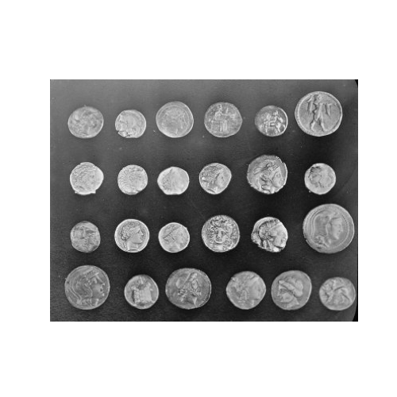

#### Result

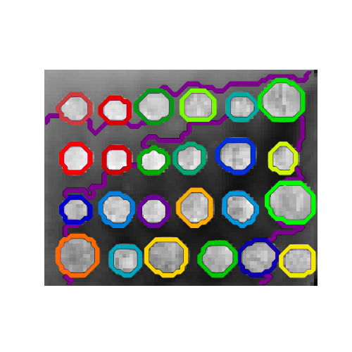

## K-Means

K-Means is a clustering algorithm that clusters the data points based on the underlying distribution. It is used to cluster data into representative groups.

### Color Quantization

#### Source Image: 96,615 colors

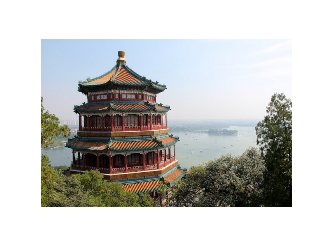

#### Quantized image: 64 colors

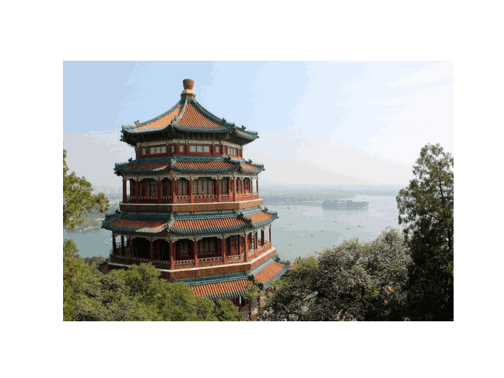

#### Quantized image: 32 colors

#### Quantized image: 16 colors

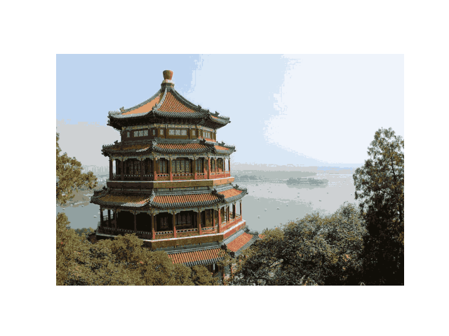

#### Quantized image: 8 colors

#### Quantized image: 4 colors

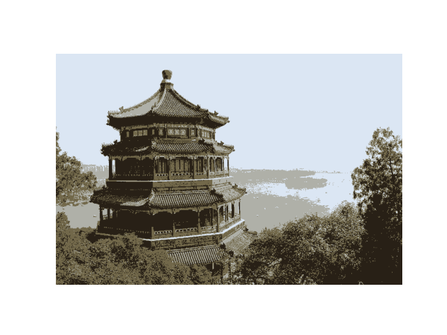

#### Quantized image: 2 colors

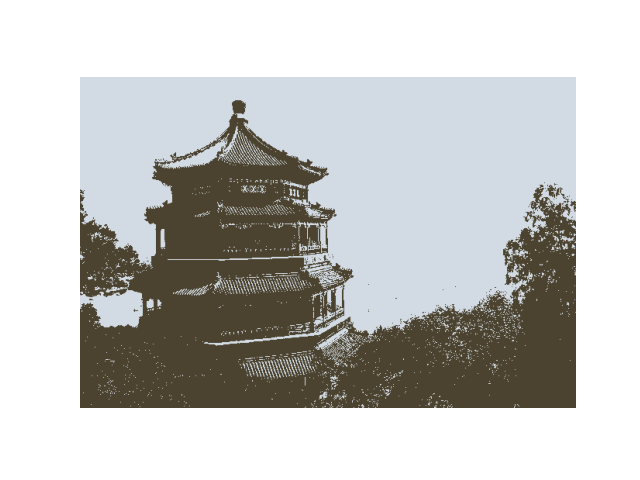

# Neural Networks

Neural network is a multi-layer perceptron with a very wide and deep set of hyperparameters that can find solutions to complex problems. 

### Digits Recognition

#### Fragment of the Test Dataset

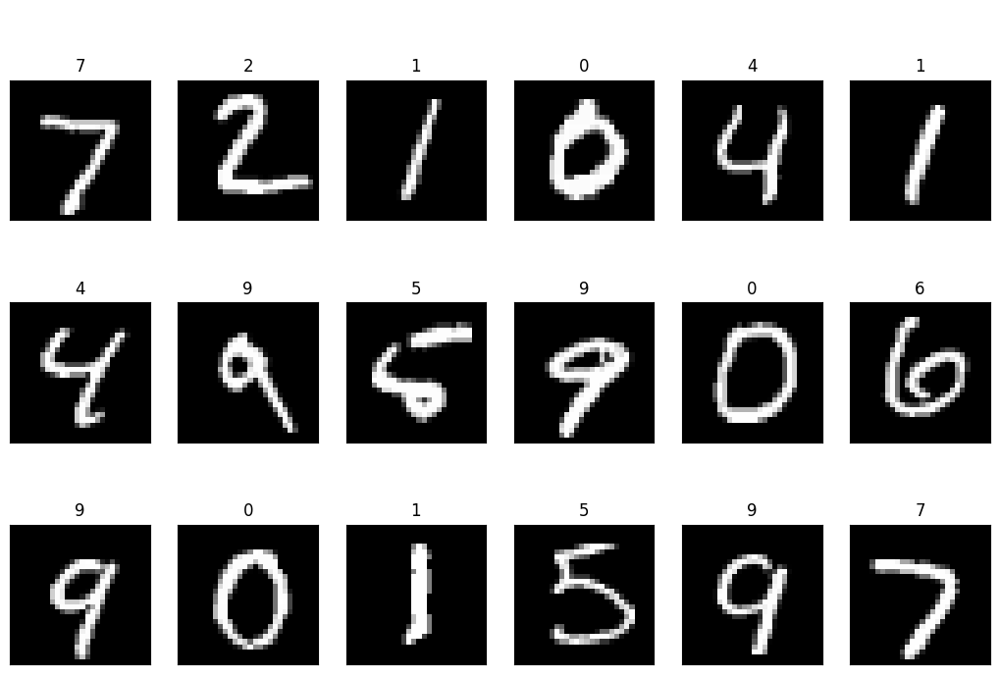

#### Prediction Result

### Deep Dreaming

Deep dreaming is the process of generating images of an artistic style using computer vision. It is similar to painting, except that it tries to increase the intensity of the image by changing how the content of the image is encoded.

#### Source Image

#### Dream at Scale 57 x 86

#### Dream at Scale 80 x 121

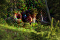

#### Dream at Scale 113 x 170

#### Final Dream

# Image Generation

## Stable Diffusion

Stable diffusion is a generative model that uses a diffusion process to generate images. It is based on the idea of using a diffusion process to generate images from random noise.

### Examples

Model: "stabilityai/sdxl-turbo"

Prompt: "a cyberpunk cat wearing VR goggles"

Model: "emilianJR/epiCRealism"

Motion adapter: "guoyww/animatediff-motion-adapter-v1-5-2"

Prompt: "A robot dancing, 4k, cinematic"

# Sources

- [https://nbviewer.jupyter.org/github/ogrisel/notebooks/blob/master/Labeled%20Faces%20in%20the%20Wild%20recognition.ipynb](https://nbviewer.jupyter.org/github/ogrisel/notebooks/blob/master/Labeled%20Faces%20in%20the%20Wild%20recognition.ipynb)
- [https://scikit-learn.org/0.18/auto_examples/applications/face_recognition.html](https://scikit-learn.org/0.18/auto_examples/applications/face_recognition.html)
- [https://nbviewer.jupyter.org/github/fchollet/deep-learning-with-python-notebooks/blob/master/2.1-a-first-look-at-a-neural-network.ipynb](https://nbviewer.jupyter.org/github/fchollet/deep-learning-with-python-notebooks/blob/master/2.1-a-first-look-at-a-neural-network.ipynb)
- [https://www.askpython.com/python/examples/decision-trees](https://www.askpython.com/python/examples/decision-trees)
- [https://nbviewer.jupyter.org/github/fchollet/deep-learning-with-python-notebooks/blob/master/8.2-deep-dream.ipynb](https://nbviewer.jupyter.org/github/fchollet/deep-learning-with-python-notebooks/blob/master/8.2-deep-dream.ipynb)
- [https://scikit-learn.org/stable/auto_examples/cluster/plot_coin_ward_segmentation.html#sphx-glr-auto-examples-cluster-plot-coin-ward-segmentation-py](https://scikit-learn.org/stable/auto_examples/cluster/plot_coin_ward_segmentation.html#sphx-glr-auto-examples-cluster-plot-coin-ward-segmentation-py)
- [https://scikit-learn.org/stable/auto_examples/cluster/plot_color_quantization.html#sphx-glr-auto-examples-cluster-plot-color-quantization-py](https://scikit-learn.org/stable/auto_examples/cluster/plot_color_quantization.html#sphx-glr-auto-examples-cluster-plot-color-quantization-py)